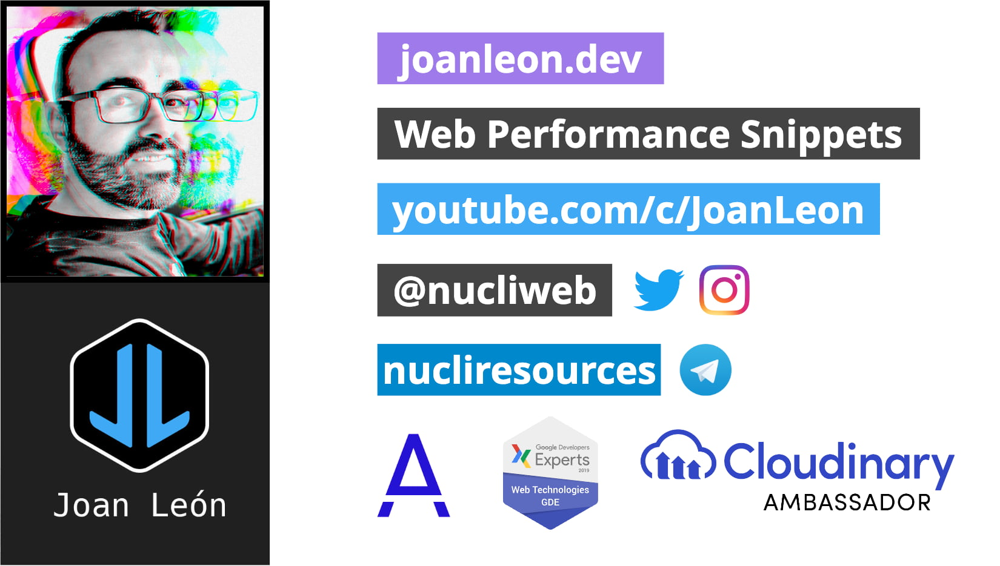

# Taller Optimización de imágenes para la web | Pulpocon 2024

Como profesionales del desarrollo web, nos preocupamos de escoger el mejor framework, las buenas prácticas en JavaScript y CSS, de la semántica en el HTML, de la accesibilidad de nuestro contenido, pero ¿qué pasa con las imágenes?

Las imágenes representan hasta el 60% del contenido de los sites, desde julio de 2017 en un site promedio de 3.0Mb, 1.7Mb son imágenes.

Cargamos imágenes innecesarias, con formatos inadecuados y no adaptadas al tamaño de pantalla del usuario, Todo ello acaba en una peor experiencia para el usuario.

¿Qué aprenderemos en el workshop?

1. Herramientas de análisis.

2. Crearemos un entorno para optimizar nuestras imágenes de forma automática.

3. Añadiremos tests para validar la calidad de las imágenes.

4. Adaptaremos nuestras imágenes para mejorar la percepción de carga.

[](https://slides.com/joanleon/nucliweb)

## Requirements

Ths project needs [Node 20+](https://nodejs.org/en/download/package-manager)

## Intall

Run the next command in the root of the project.

```bash
npm install
```

## Run server

Run the next command to run the server.

```bash
npm run start
```

## Releases links

| Web                                                                                                                      | Folder                                                                        |
| ------------------------------------------------------------------------------------------------------------------------ | ----------------------------------------------------------------------------- |
| [main](https://main--image-optimization-workshop.netlify.app/)                                                           | [main](https://github.com/nucliweb/image-optimization-workshop/)              |
| [image-optim](https://image-optim--image-optimization-workshop.netlify.app/)                                             | -                                                                             |
| [image-optim-webp](https://image-optim-webp--image-optimization-workshop.netlify.app/)                                   | -                                                                             |
| [image-optim-next-gen](https://image-optim-next-gen--image-optimization-workshop.netlify.app/)                           | [image-optim-next-gen](./workshop/image-optim-next-gen)                       |
| [image-optim-loading-lazy](https://image-optim-loading-lazy--image-optimization-workshop.netlify.app/)                   | [image-optim-loading-lazy](./workshop/image-optim-loading-lazy)               |
| [image-optim-css-images](https://image-optim-css-images--image-optimization-workshop.netlify.app/)                       | [image-optim-css-images](./workshop/image-optim-css-images)                   |
| [image-optim-responsive-images](https://image-optim-responsive-images--image-optimization-workshop.netlify.app/)         | [image-optim-responsive-images](./workshop/image-optim-css-responsive-images) |
| [image-optim-css-responsive-images](https://image-optim-css-responsive-images--image-optimization-workshop.netlify.app/) | [image-optim-css-responsive-images](./workshop/image-optim-responsive-images) |
| [image-optim-cloudinary](https://image-optim-cloudinary--image-optimization-workshop.netlify.app/)                       | [image-optim-cloudinary](./workshop/image-optim-cloudinary)                   |
| [image-optim-video](https://image-optim-video--image-optimization-workshop.netlify.app/)                                 | [image-optim-video](./workshop/image-optim-video)                             |
| [image-optim-video-cloudinary](https://image-optim-video-cloudinary--image-optimization-workshop.netlify.app/)           | [image-optim-video-cloudinary](./workshop/image-optim-video-cloudinary)       |

## Resources

- [Best practices for images](https://github.com/nucliweb/image-element)
- [Optimización de imágenes y vídeo para la web](https://slides.com/joanleon/optimizacion-de-imagenes-y-video-para-la-web-57bbad)
- [Learn Images](https://web.dev/learn/images/)
- [Largest Contenful Paint](https://web.dev/lcp/)
- [¿Por dónde empiezo para optimizar mis imágenes?](https://joanleon.dev/por-donde-empiezo-para-optimizar-mis-imagenes)
- [El formato vídeo en la web](https://perf.reviews/blog/video-en-la-web/)
- [📘 Image Optimization](https://www.smashingmagazine.com/printed-books/image-optimization/)
