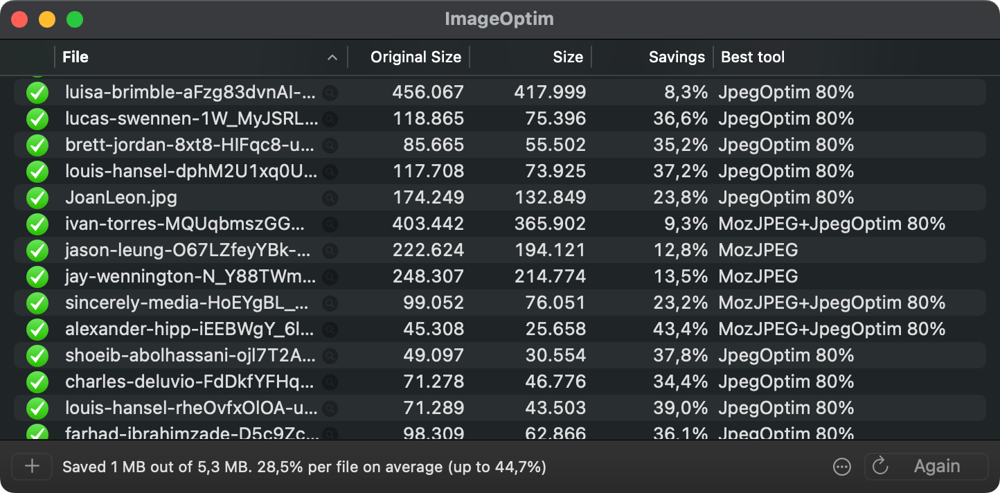
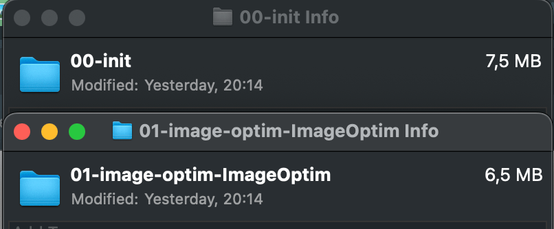
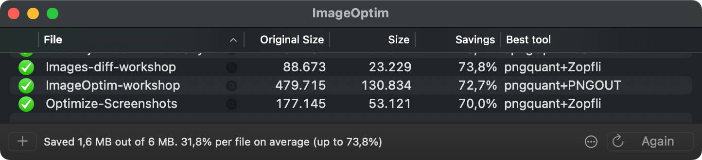

# Image Optimization Workshop

## Prerequisites

To optimize the images we'll use [ImageOptim](https://imageoptim.com/mac).

## Optimize all the images in the project

Drag & drop the project folder to the ImageOptim window.

## Optimized images

## Optimize all your images 😜

